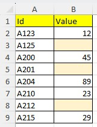
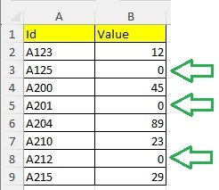

# What is Lexerow ?
Lexerow is a backend dotnet library to process easily datarows and cells in Excel files (xlsx).

You can for example detect empty cell in a column and set a specific value. 
You can compare a cell value to a specific value and then put a new value in the same cell row or in another cell.

Lexerow is developed in C# and can be used in any dotnet application. 

Lexerow is an open source library.

# A quick example

## Problem: empty cells

You have an Excel file containing a datatable: the first line is the header, and others are datarows of the table.
In column B, some cells are empty, and it's a problem. It would better to have a value in each cell.


<p align="center">
    
</p>

So to put the value 0 in each empty cell in column B, Lexerow will help you to do that easily with few lines of code.

<p align="center">
    
</p>

## The solution
 
-1/ Create a script to fix cell values in the Excel datatable.

-2/ Create a dotnet program to execute your script.

-3/ Feel free to modify the script as needed and execute it again.

## The Script to fix values

To process datarow of the excel file as explained, Lexerow provide a powerful instruction which is: OnExcel.

Let's consider the excel file to fix blank values is "file.xlsx".
The first row is the header. Data starts at the second row which is the default case.

Create a basic script and save it let's say with this name: "script.lxrw"

The file name extension is free.

```
# process datarow of the Excel, one by one
OnExcel "file.xlsx"
    ForEachRow
	  If B.Cell=blank Then B.Cell=0
    Next
End OnExcel	
```

The script will scan each datarow present in the first sheet starting by defaut from the row #2.
Each time the cell value in column B is blank, the int value 0 is set in place.
The execution will stop automatically after the last row was processed.

This a very basic script, but of course it's possible to create more complex, more precise script to manage all your specific cases.


## A C# program to execute the script

First import the nuget Lexerow package in your solution or project. 

Create a program in C# and use it in this way:

```
// create the core engine
LexerowCore core = new LexerowCore();

// load and execute the script   
core.LoadExecScript("MyScript", "MyScript.lxrw");   
```

This is the smallest C# program you have to write.

# Package available on Nuget

Lexerow library is packaged as a nuget ready to use:

https://www.nuget.org/packages/Lexerow


# to go further with script

If the header of the datatable use 2 rows or more, tt's possible to set a different first data row. For example, start at the row #3 in place of default row #2. You may use the instruction FirstRow.

```
# process datarow of the Excel, one by one
OnExcel "file.xlsx"
	FirstRow 3
    ForEachRow
	  If B.Cell=blank Then B.Cell=0
    Next
End OnExcel	
```

It's possible to check many cases in If instruction.

```
If A.Cell=12
If A.Cell>8.55
If A.Cell<>"Hello"
If A.Cell=blank
If A.Cell=null
```

In Then block, you can set a value to a cell.
Type of value can be: int, double, string.

Date and time will be managed later.

To clear the cell value, you have to put blank in it. 
The formating of the cell will remain: background color and border.

To remove completly a cell, to have to set it to null.
 

```
Then A.Cell=13
Then A.Cell=25.89
Then A.Cell="Hello"
Then A.Cell=blank
Then A.Cell= null
```

Several instructions in Then block is also possible, example:

```
OnExcel "file.xlsx"
	FirstRow 3
    ForEachRow
	  If A.Cell="Y" Then 
		A.Cell="N"
		B.Cell=25.89
		C.Cell=blank
		End If
    Next
End OnExcel	
```

You can also manage easily errors occuring during compilation or during the execution of scripts.

```

// load and execute the script   
var result= core.LoadExecScript("MyScript", "MyScript.lxrw");   
if(!result.Res)
{
	// errors occured -> result.ListError.Count
}
```

# Project Wiki

You can find more information on how to create more powerful scripts:

https://github.com/Pierlam/Lexerow/wiki


# Dependency

To access Excel content file, Lexerow uses the great NPOI library available on Nuget here:

https://www.nuget.org/packages/NPOI

NPOI source code is hosted on github here:

https://github.com/nissl-lab/npoi


