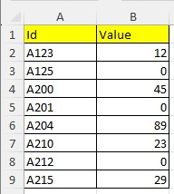

# What is Lexerow ?
Lexerow is a backend dotnet library to process very easily datarows and cells in Excel files.
You can for example detect empty cell in a column and set a specific value.

Lexerow is developed in C# and can be used in any dotnet application.

# A quick example

## Problem: empty cells

You have an Excel file containing a datatable: the first line is the header, and others datarows.
In one column, some cells are empty, and it's a problem to do calculation.


The goal is for each empty cell in the column B, to put in place the value 0.
Lexerow can do that very easily.and you want to put in place the value 0.




## How to proceed

Process rows in a Excel file datatable.
For each row, if cell of column A is empty then set value 0.

<image excel>

Source Code:
```
   LexerowCore core = new LexerowCore();
   string fileName = "MyExcelFile.xlsx";
   ExecResult execResult = core.Builder.CreateInstrOpenExcel("file", fileName);
todo:
```


