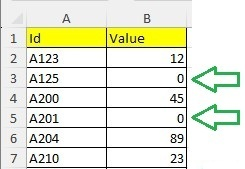

# What is Lexerow ?
Lexerow is a backend dotnet library to process very easily datarows and cells in Excel files.
You can for example detect empty cell in a column and set a specific value.

Lexerow is developed in C# and can be used in any dotnet application.

# A quick example

## Problem: empty cells

You have an Excel file containing a datatable: the first line is the header, and others are datarows of the table.
In column B, some cells are empty, and it's a problem to do calculation. It would better to have a value in each cell.


<p align="center">
    
</p>

So to put the value 0 in each empty cell in column B, Lexerow will help you to do that easily.

<p align="center">
    
</p>


## How to proceed

Create a program in C# and use the Lexerow library in this way:

```
LexerowCore core = new LexerowCore();
string fileName = "MyFile.xlsx";
   
// file= OpenExcel("MyExcelFile.xlsx")
core.Builder.CreateInstrOpenExcel("file", fileName);
   
//--Comparison: B.Cell=null  (B -> index 1)
InstrCompColCellValIsNull instrCompIf = core.Builder.CreateInstrCompCellValIsNull(1);

//--Set: B.Cell= 0
InstrSetCellVal instrSetValThen = core.Builder.CreateInstrSetCellVal(1, 0);

// If B.Cell=null Then B.Cell= 0
InstrIfColThen instrIfColThen;
core.Builder.CreateInstrIfColThen(instrCompIf, instrSetValThen, out instrIfColThen);

// ForEeach Row IfColThen, sheetNum=0, firstDataRow=1 below the header
core.Builder.CreateInstrOnExcelForEachRowIfThen("file", 0, 1, instrIfColThen);

// execute the instruction -> empty cells in col B will be remplaced by the value 0
core.Exec.Execute();
```


